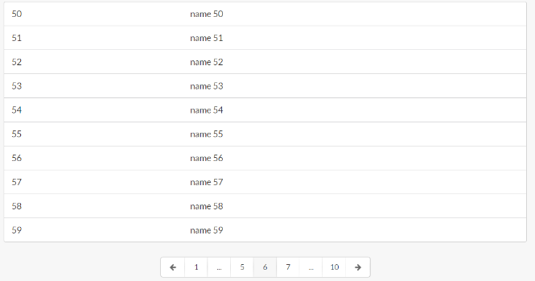

# sm-pagination

Basic pagination for mithril and semantic

It requires mithril and semantic-ui-menu

Pagination file can be used with any common.js it is expect for [mithril](https://github.com/lhorie/mithril.js) to be in global (m variable) or it will attempt to load it with `require('mithril')`, [webpack](http://webpack.github.io/docs/) its recommended



## Demo

[Demo](http://pinguxx.github.io/sm-pagination/)

```html
<!DOCTYPE html>
<html>
<head>
    <link rel="stylesheet" href="https://cdnjs.cloudflare.com/ajax/libs/semantic-ui/1.10.3/semantic.min.css">
    <script src="bower_components/mithril/mithril.js"></script>
    <script src="Pagination.js"></script>
</head>
<body>
    
    <script src="test.js"></script>
</body>
</html>

```

```JavaScript

function list(data) {
    return m('.ui.segment.sixteen.wide.column', [
        m('ul.ui.bulleted.list', data.map(function (item) {
            return m('li', {
                key: item.id
            }, item.name);
        }))
    ]);
}

function table(data) {
    return m('.ui.sixteen.wide.column', [
        m('table.ui.table', [
            m('tbody', data.map(function (item) {
                return m('tr', {
                    key: item.id
                }, [
                    m('td', item.id),
                    m('td', item.name)
                ]);
            }))
        ])
    ]);
}

module.controller = function () {
    module.vm.init();
    this.pagination = m.component(Pagination, {
        data: module.vm.data,
        rowsperpage: module.vm.rowsperpage,
        pagerender: list,
        wrapperclass: 'column'
    });
    this.paginationCtrl = new this.pagination.controller();
};

module.vm = {};
module.vm.init = function () {
    this.data = array;
    this.rowsperpage = 10;
    this.page = m.prop(3);
};


module.view = function (ctrl) {
    return m('.ui.grid.page.one.column', [
        m('h1', 'Pagination'),
        m.component(Pagination, {
            data: module.vm.data,
            rowsperpage: module.vm.rowsperpage,
            pagerender: list,
            wrapperclass: 'column',
            page: module.vm.page
        }),
        m.component(Pagination, {
            data: module.vm.data,
            rowsperpage: module.vm.rowsperpage,
            pagerender: table,
            wrapperclass: 'column'
        }),
        m('.row', [
            m('.column', [
                m('br')
            ])
        ]),
        ctrl.pagination.view(ctrl.paginationCtrl),
        m('.row', [
            m('.column', [
                m('button.ui.button', {
                    onclick: function () {
                        module.vm.data.splice(30, 10);
                        ctrl.paginationCtrl.goToPage(4);
                        module.vm.page(4);
                    }
                }, 'go to page 3')
            ])
        ])
    ]);
};

m.mount(window.document.body, module);

```

## Attributes

It accepts the following properties

 * data, array of data to paginate
 * rowsperpage, # of rows to show each page
 * pagerender, page render function
 * wrapperclass, class to add to parent div
 * page, m.prop value of the current page
 * class object map with:
    * **activeClass**, applied to the active icons, defaults `active`
    * **itemClass**, applied to non icon items, defaults `icon`
    * **leftIconClass**, applied to the left arrow icon item, defaults `left arrow icon`
    * **rightIconClass**, applied to the right arrow icon item, defaults `right arrow icon`
    * **iconItemClass**, applied to the icon item items, defaults `icon item`,
    * **disabledClass**, applied to disaled items, defaults `disabled`
    * **menuClass**, applied to the menu pagination parent div, defaults `ui pagination menu small`
